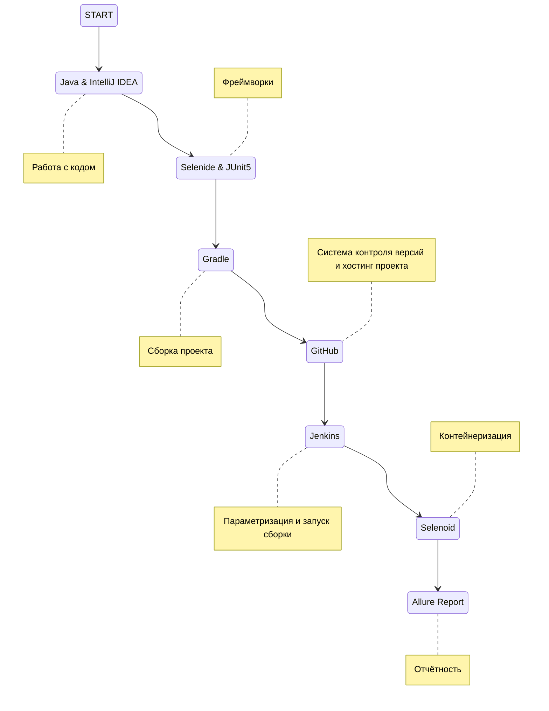
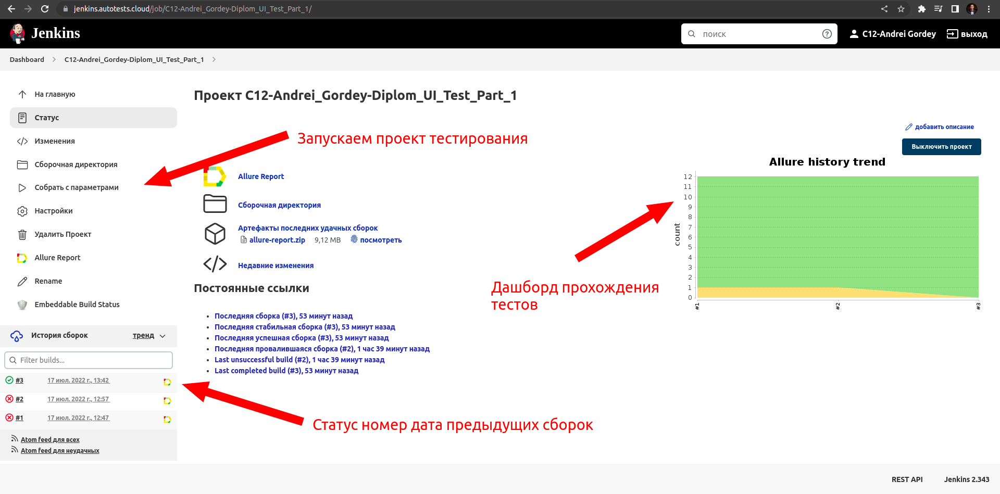
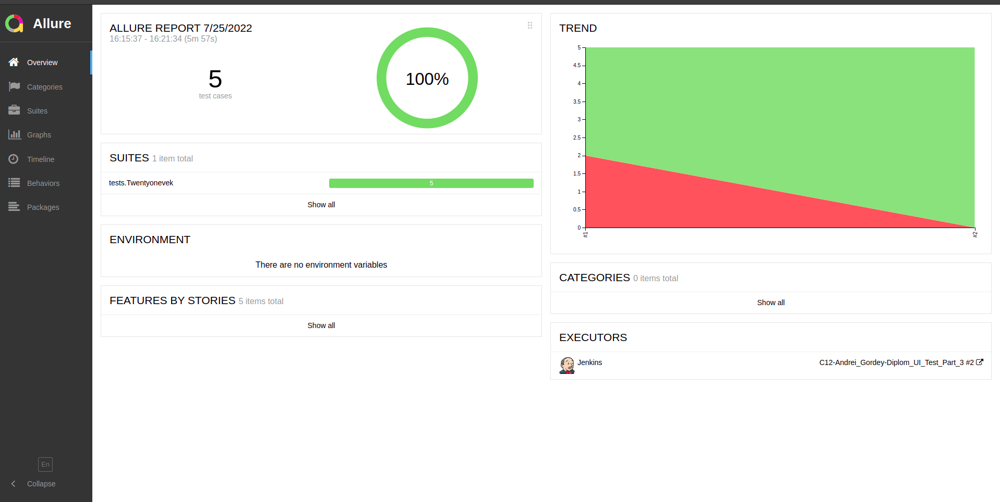
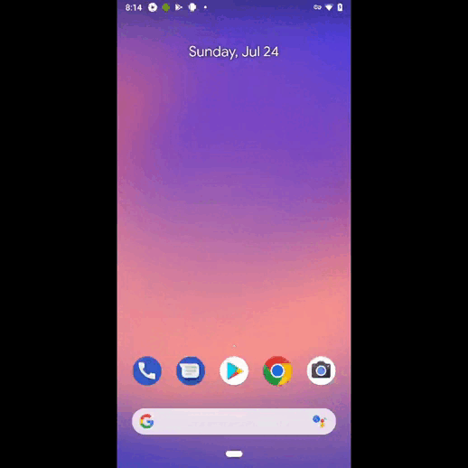

# Проект по автоматизации тестирования мобильного приложения для части дипломного проекта онлайн-гипермаркета 21vek.by 
## <p align="center"> :arrow_right: <a target="_blank" href="https://www.21vek.by/">Онлайн-гипермаркет 21vek.by</a> :arrow_left: </p>
### <a target="_blank" href="https://jenkins.autotests.cloud/job/C12-Andrei_Gordey-Diplom_UI_Test_Part_3/">Сборка в Jenkins</a>

## :floppy_disk: Содержание:

- <a href="#computer-технологии-и-инструменты">Технологии и инструменты</a>
- <a href="#notebook_with_decorative_cover-реализованные-проверки">Реализованные проверки</a>
- <a href="#electric_plug-сборка-в-Jenkins">Сборка в Jenkins</a>
- <a href="#arrow_forward-запуск-из-терминала">Запуск из терминала</a>
- <a href="#open_book-allure-отчет">Allure отчет</a>
- <a href="#film_projector-видео-примеры-прохождения-тестов">Видео с примером прохождения теста авторизации</a>

## :computer: Технологии и инструменты
<p align="center">


[//]: # ()
</p>



## :notebook_with_decorative_cover: Реализованные проверки
- Проверка наличия элементов главной страницы
- Проверка открытия вкладки "Все Акции"
- Проверка открытия вкладки "Каталог"
- Проверка наличия разделов в "Каталоге"
- Проверка добавления товара из главной страницы в корзину


## :electric_plug: Сборка в Jenkins
### <a target="_blank" href="https://jenkins.autotests.cloud/job/C12-Andrei_Gordey-Diplom_UI_Test_Part_3/">Сборка в Jenkins</a>
<p align="center">

</p>  

## :arrow_forward: Запуск из терминала
Локальный запуск:
```
gradle clean test
```

Удаленный запуск:
```
clean
test
```
## :open_book: Allure отчет
- ### Главный экран отчета
<p align="center">

</p>

- ### Страница с проведенными тестами
<p align="center">

</p>


## :film_projector: Видео примеры прохождения тестов
> К каждому тесту в отчете прилагается видео. Как пример, видео проверки добавления товара в корзину с главной страницы.
<p align="center">
  
</p>